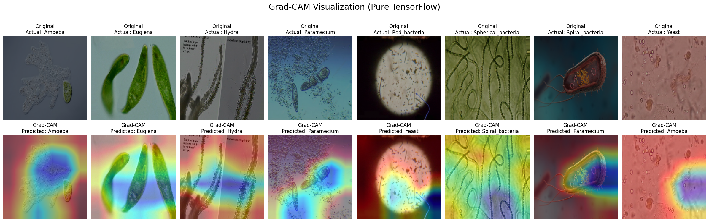
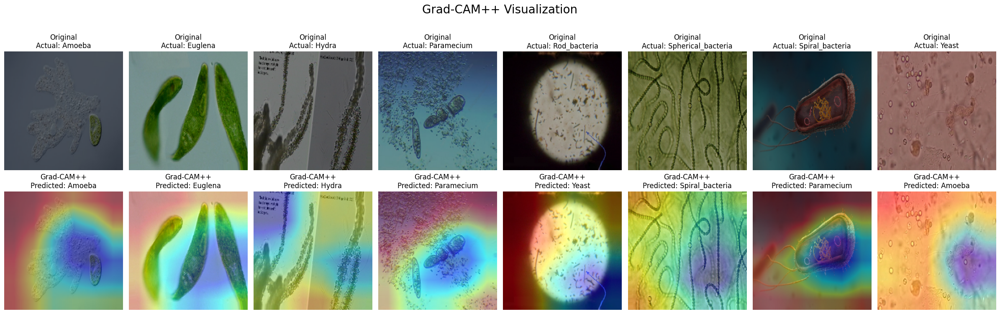
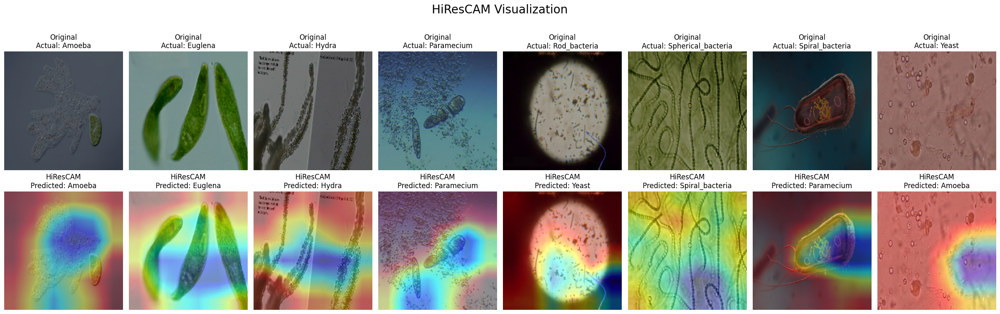

# Explainable-Deep-Learning-Microorganism-Image-Classification

[](https://github.com/U1186204/Explainable-Deep-Learning/tree/main)

[](https://github.com/U1186204/Explainable-Deep-Learning/actions/workflows/ci.yml)

[](https://colab.research.google.com/github/U1186204/Explainable-Deep-Learning/blob/main/main.ipynb)


**by Christian Moreira**

*Graduate Student at Duke Univesity*


### Abstract

This work examines the image classification for 8 microorganism classes: Amoeba, Euglena, Hydra, Paramecium, Rod_bacteria, Spherical_bacteria,Spiral_bacteria, Yeast. First, it runs the Inception V3 model to perform image classificaiton of the micro-orgnism images in the dataset. Then it evaluates the model's last layer using the XAI technique GradCAM. Lastly, it employs 2 GradCAM variants for the image heatmap classifier evluation: GradCAM++ and HiResCAM.

### Project Flowchart


### Project Tree

```txt
Explainable-Deep-Learning/
├── .github/
│   └── workflows/
│       └── ci.yml
├── experiment_images/
├── Dockerfile
├── LICENSE
├── README.md
├── inception-v3.h5
├── llm_log.txt
├── main.ipynb
└── requirements.txt
```

### Inception V3 Predictions

- The above image represents the Actual vs Predicted outcomes of Inception V3 Model.
- While the model is correctly employed, it is the case that at times  it generates outputs that may not necessarily be accurate i.e. The predicted outputs are different from the actual image class label.
- The subsequent steps will evaluate the heatmap in last layer of the model. This XAI technique helps visualize which image elements the model is considering the most when making a microorganism prediction.


### GradCAM Results



- It appears this model is more general on one hand while not being exactly the most precise in detecting shapes on the other hand.
- The model helps get a broad idea about which elements and patterns are being considred for classification of each micro-organism image.
- It does help distinguish what might be a micro-organism in relationship to a standard backgorund color.
- Apparently in the Amoeba, Euglena, and Yeast examples the heatmap does not perfectly align with the shape of the micro-organism object. GradCAM++ and HiResNET might help in evaluating these shapes with better shape precision.


### GradCAM++ Results



- GradCAM++ provides much better shape detection for an entire object than the first GradCAM heatmap detector.
- The Heatmaps appear to capture more the outline of organisms,  focused on the body of the microorganism, and less spread out than the previous model.
- For example, clear improvements are observed in the Amoeba and Spiral Bacteria shape detection. Yeast seems more complicated to form shapes around as the image exhibits many spread out elements all over wihtout a single focused object.
- These spread elements could compromise precision as the model in unable to distinguish what might be a Yeast relative to other potential "distracting" backgorund elements(which may not necessarily contain yeast patterns).


### HiResCAM Results



- HiResCam is employed to evaluate images with much more sharpness and produce the most detailed pattern explanations.
- Its high resolution highlight edges and textures quite well on one hand. However the heatmap for Amoeba for example seem to return to a similar focus area to that seen on GradCAM.
- For Spiral Bacteria and Hyrdra however organism vs. background detection appears to be precisely distinguished.
- For Euglena, it highlighted the organism's outer tail which seems very unique.


### Conclusion

**Visual Cues The Model Attends To**

The above models seem to perform well when detecting organisms of a clearer distiguishable shape. Most had satifactory performance it finding unique organism cues for Spiral Bacteria, Euglena, Paramecium and Spherical Bacteria. But each of these contain very clear elements that helps discern them form others such as:
- A unqiue tail on top of the membrane boundaries for Euglena
- A zigzag pattern for Spiral Bacteria
- A cluster of elements within a membrane of a Paramecium.

**Misleading Model Behavior**

In the case of Yeast where the organisms are scattered it is much harder for a model to pinpoint what is an organism versus what might be the background. It is hard to tell what the model is actually focused on: whether it is in finding the yeast shape or finding a scattered pattern within the limits of the image.  

**Why Model Explainability is Relevant in the Micro-Organism Detection Domain?**

Explainability is important in the science domain particularly in pathology and biology image detection. A physician or researcher could be intrested in examining which elements of an image a model is evaluating when making its prediction. It is critical that a model's features align with the actual scientific critra used to distinguish and detect micro-organisms. Opening the the black box of a neural network is becomes important for preventing and addressing errors, as heatmaps show why a model could be misclassifying and how it might be correcly classifying organisms.
